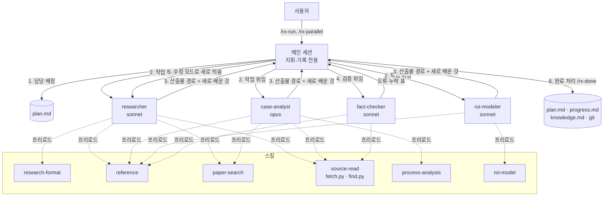
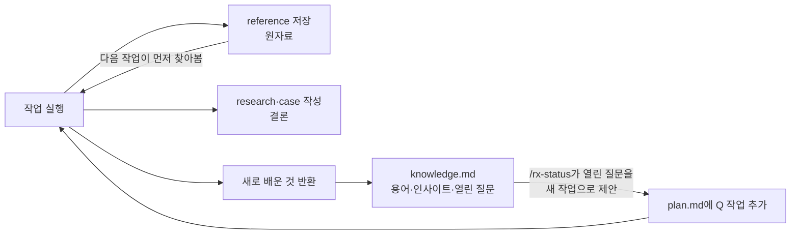

# RLWRLD RX Prep

RLWRLD(리얼월드) **Robotics Transformation(RX)** 팀의 업무를 실무자 관점에서 직접 해본다 생각하고 리서치 겸 프로젝트를 진행해봤습니다.

## 주요 산출물

| 문서 | 내용 |
|------|------|
| [case/b4-proposal.md](case/b4-proposal.md) | **최종 제안서.** 자동차 와이어 하네스 조립 RX 제안 (공정, 난제, 경쟁, 솔루션, 경제성, 도입 구조, 게이트형 PoC, 리스크) |
| [case/analysis.md](case/analysis.md) | 하네스 조립 공정 심층 분석, ROI 가정값 표 |
| [case/candidates.md](case/candidates.md) | 후보 공정 5개 점수화와 선정 근거 |
| [research/company.md](research/company.md) | RLWRLD 회사, 투자, 인물, RLDX-1, 경영진 전략 |
| [research/poc-playbook.md](research/poc-playbook.md) | 선도기업 PoC→배포 프로세스와 RLWRLD PoC 설계 체크리스트 |
| [research/rx-cases.md](research/rx-cases.md) | RLWRLD RX 방식과 해외 9개사 도입 사례 |
| [research/skild-pi-deep-dive.md](research/skild-pi-deep-dive.md) | Skild AI, Physical Intelligence 심층 비교 |
| [research/rldx1-tech.md](research/rldx1-tech.md) | RLDX-1 아키텍처, 학습 3단계, 평가 조건, 한계, 하네스 케이스 근거 |
| [research/](research/) | 기술(tech), 경쟁사(competitors), 하드웨어(hardware), 시장(market), 논문(papers) |

## 진행 현황

| ID | 작업 | 상태 |
|----|------|------|
| A1~A6 | 회사, 기술, 경쟁사, 하드웨어, 시장, 논문 리서치 | 완료 |
| A7, A8 | RX 방식·해외 사례, Skild·PI 심층 | 완료 |
| A10 | PoC→배포 플레이북 | 완료 (fact-check 미실시) |
| A11 | RLDX-1 공식 기술 블로그 분석, 기존 문서 정정 14건 | 완료 (fact-check 미실시) |
| B1 | 후보 공정 선정 → 와이어 하네스 조립 | 완료 |
| B2 | 공정 심층 분석 | 완료 (fact-check 미실시) |
| B3 | ROI 엑셀 모델 | 보류 |
| B4 | 제안서 | 진행 중 (실무자 검토) |

작업별 상세 상태는 [plan.md](plan.md), 작업 기록은 [progress.md](progress.md)를 본다. 공개 웹에서 확인하지 못해 직접 확인이 필요한 항목은 [manual-research.md](manual-research.md)에 정리했다.

## 폴더 구조

```
CLAUDE.md          # Claude Code 규칙: 역할, 협업 절차, 토큰 배분
plan.md            # 작업 목록, 담당, 상태 (무엇을 할지)
progress.md        # 작업 기록, 추가만 함 (어디까지 했는지)
knowledge.md       # 팀 공용 산업 지식: 용어집, 인사이트, 열린 질문
research/          # 주제별 리서치 결론
case/              # 하네스 고객 케이스 (B1~B4)
reference/         # 근거 원자료, 소스 1건당 파일 1개 (<태그>--<슬러그>.md)
reference/raw/     # 원문 텍스트 (저작권 때문에 커밋하지 않음)
.claude/
  settings.json    # 프로젝트 권한, 기본 모델
  agents/          # 서브에이전트 4개
  skills/          # 커맨드(rx-*)와 방법론 스킬
  agent-memory/    # 에이전트별 노하우
```

## 지식이 쌓이는 방식

| 층 | 위치 | 담는 것 |
|----|------|---------|
| 원자료 | `reference/` | 기사, 공식 문서, 논문 1건당 1파일. 핵심 사실과 원문 발췌 |
| 결론 | `research/`, `case/` | 작업 산출물 |
| 공용 지식 | `knowledge.md` | 용어집, 인사이트, 열린 질문 (열린 질문이 다음 작업 후보가 됨) |
| 노하우 | `.claude/agent-memory/` | 에이전트별로 쓸모 있던 소스, 막힌 사이트, 실수 |

## 에이전트와 스킬이 상호작용하는 방식

### 전체 구조
메인 세션은 **지휘와 기록**만 하고, 실제 조사·분석·검증은 서브에이전트가 한다. 각 에이전트는 시작할 때 필요한 스킬을 미리 불러오고(`skills:` 프리로드), 공용 파일을 읽고 쓰는 범위가 정해져 있다.



### 작업 하나가 처리되는 순서 (`/rx-run A1`)
| 단계 | 누가 | 무엇을 | 쓰는 스킬·파일 |
|------|------|--------|----------------|
| 0. 준비 | 메인 | `plan.md`에서 선행 작업이 끝났는지, 다른 에이전트가 맡고 있지 않은지 확인하고 담당을 표시 | plan.md |
| 1. 기존 지식 확인 | 담당 에이전트 | `knowledge.md`(용어, 인사이트, 열린 질문)와 `reference/`(이미 모은 원자료)를 먼저 읽어 중복 조사를 피함 | reference |
| 2. 탐색 | researcher, case-analyst | 한국어·영어·일본어로 웹 검색, 기술 주제는 논문 검색 | WebSearch, paper-search |
| 3. 원문 확보 | researcher, case-analyst | 1차 소스와 논문은 원문을 `reference/raw/`에 저장하고 `find.py`로 필요한 줄만 검색. 2차 기사는 WebFetch로 훑음(작업당 15개 안팎) | source-read |
| 4. 근거 저장 | researcher, case-analyst | 인용한 소스마다 `reference/<태그>--<슬러그>.md`에 핵심 사실과 원문 발췌를 저장 | reference |
| 5. 산출물 작성 | 담당 에이전트 | 템플릿에 맞춰 문서를 한 번의 Write로 완성 | research-format, process-analysis, roi-model |
| 6. 반환 | 담당 에이전트 | 산출물 경로, 요약, 확인 못 한 항목, **새로 배운 것**(용어·인사이트·열린 질문)을 메인에 반환. 일하는 법은 자기 메모리에 기록 | agent-memory |
| 7. 검증 | fact-checker | 핵심 수치 5개는 원문을 직접 열어 대조하고, 나머지는 reference 발췌와 대조. 파일은 고치지 않고 오류·누락 표만 반환 | reference, source-read |
| 8. 수정 | 담당 에이전트 (새로 띄움) | fact-checker 표에 있는 항목만 고침. 긴 대화를 이어 쓰지 않도록 원래 에이전트가 아니라 새 에이전트로 띄움 | - |
| 9. 완료 | 메인 | plan을 `완료`로, progress에 기록 추가, 반환받은 "새로 배운 것"을 knowledge.md에 반영, 커밋·푸시 | rx-done |

### 서로 겹치지 않게 하는 규칙
| 파일 | 쓰기 | 이유 |
|------|------|------|
| plan.md, progress.md, knowledge.md, git | 메인만 | 여러 에이전트가 동시에 고치거나 커밋하면 충돌 |
| research/, case/ 산출물 | 담당 에이전트만 | 메인이 직접 고치면 긴 대화 전체를 매번 다시 읽어 비용이 큼 |
| reference/ | researcher, case-analyst | 원자료 저장 |
| 모든 파일 | fact-checker는 쓰지 않음 | 검증자가 고치면 검증이 순환함 |

예외: Claude Code가 서브에이전트의 보고서 파일 쓰기를 막으면, 에이전트가 전문을 반환하고 메인이 내용 수정 없이 그대로 저장한다.

### 작업이 다음 작업을 낳는 순환

- 다음 작업은 `reference/`와 `knowledge.md`를 먼저 읽기 때문에 같은 소스를 다시 조사하지 않는다.
- 에이전트별 메모리(`.claude/agent-memory/`)에는 "어떤 사이트가 막혔는지, 어떤 검색어가 잘 통했는지" 같은 일하는 법이 쌓여 다음 실행이 빨라진다.

### 모델 배분
| 단계 | 모델 | 이유 |
|------|------|------|
| 메인 (지휘, 기록) | sonnet (프로젝트 기본값) | 판단보다 절차가 많음 |
| researcher, fact-checker, roi-modeler | sonnet | 많이 읽는 작업, 정형 작업 |
| case-analyst | opus | 공정 선정과 분석은 판단이 가장 많이 필요한 핵심 산출물 |
| 웹 페이지 요약 (WebFetch 내부) | haiku | 도구가 자동으로 사용. 비용이 여는 페이지 수에 비례 |
| 최종 제안서, 모의 면접 | opus (`/model opus`로 전환) | 최종 결과물 |

## 사용법 (Claude Code)

### 준비
```bash
git clone https://github.com/masmukim/rlwrld-rx-prep.git
cd rlwrld-rx-prep
/usr/bin/python3 -m venv .venv && .venv/bin/pip install -r requirements.txt
claude   # 처음 열 때 폴더 신뢰를 허용해야 .claude/settings.json 권한이 적용된다
```

### 커맨드
| 커맨드 | 동작 |
|--------|------|
| `/rx-status` | 완료, 진행 중, 다음에 할 일 3줄 보고 |
| `/rx-run A1` | 작업 하나를 담당 에이전트에 배정 → 실행 → 검증 → 완료 처리 |
| `/rx-parallel` | 시작할 수 있는 대기 작업을 모두 동시에 실행 |
| `/rx-done A1` | plan·progress·knowledge 갱신 후 커밋·푸시 |
| `/rx-refresh competitors` | 기존 리서치를 최신 정보로 갱신 |
| `/rx-interview 케이스` | 자료 기반 모의 면접 |

### 에이전트
| 이름 | 담당 | 모델 |
|------|------|------|
| researcher | 웹·논문 리서치 (한국어, 영어, 일본어) | sonnet |
| case-analyst | 후보 공정 선정, 공정 분석 | opus |
| roi-modeler | ROI 엑셀 모델 | sonnet |
| fact-checker | 원문 대조 검증 (수정하지 않고 보고만) | sonnet |

메인 세션은 지휘와 기록만 하고, 조사와 수정은 에이전트에게 맡긴다. 세부 규칙은 [CLAUDE.md](CLAUDE.md)에 있다.

### 스킬
| 스킬 | 내용 |
|------|------|
| reference | reference/ 찾기·저장 |
| source-read | 원문(웹, PDF, arXiv 전문)을 저장하고 `find.py`로 필요한 줄만 검색 |
| paper-search | arXiv, OpenAlex, Semantic Scholar 논문 검색 |
| research-format | 리서치 문서 템플릿, 다국어·출처 규칙 |
| process-analysis | 후보 공정 점수표, 작업 동작 분해 |
| roi-model | ROI 시트 구성과 계산식 |
| consulting-deck | 컨설팅 문서 작성 원칙 |

## 운영 메모
- **헤드리스 실행:** `claude -p`로 돌릴 때는 백그라운드 에이전트를 기본 10분까지만 기다린다. 긴 작업은 `CLAUDE_CODE_PRINT_BG_WAIT_CEILING_MS=0`을 붙인다.
- **Python:** 항상 `.venv/bin/python`을 쓴다. 시스템 Anaconda는 openpyxl을 불러올 때 오류가 난다.
- **비용 기록:** 작업별 테스트 비용과 개선 내역은 [CLAUDE.md](CLAUDE.md)의 "토큰 배분"에 있다.
